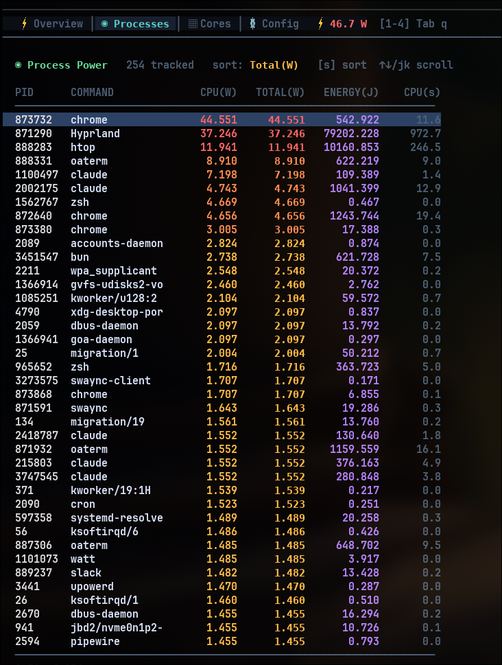

<p align="center">
  
</p>

# ⚡ watt

<p align="center">
  
  <br/>
  
</p>

Per-process power monitoring TUI for Linux.

- Real-time wattage per process, core, and package
- Custom kernel module (`powmon`) reads RAPL MSRs directly — communicates via `ioctl` on `/dev/powmon`
- Minimal overhead — no polling from userspace, no perf_events, no powercap sysfs
- Throttle detection and PL1/PL2 power limit display (Intel)
- Direct per-core energy measurement via `MSR_AMD_CORE_ENERGY_STATUS` (AMD Zen+)
- Intel (Sandy Bridge+) and AMD (Zen+)

## Build

```bash
sudo apt install linux-headers-$(uname -r) libncurses-dev   # prerequisites
make            # builds everything (kernel module + watt + tools)
```

## Run

```bash
sudo insmod kernel/powmon.ko track_all=1
sudo ./watt
```

## Keybindings

| Key | Action |
|-----|--------|
| `1-4` | Switch tabs (Overview, Processes, Cores, Config) |
| `Tab` / `Shift+Tab` | Cycle tabs |
| `Space` | Pause / resume display |
| `/` | Filter processes by name |
| `Esc` | Clear filter |
| `s` | Cycle sort column (Processes tab) |
| `j/k` or `↑/↓` | Scroll process list |
| `r` | Retry connection (when disconnected) |
| `R` | Reset stats (Config tab) |
| `q` | Quit |

## Utils

`powmon-cli` lets you query the kernel module directly from scripts or the command line:

```bash
powmon-cli info              # system info and RAPL capabilities
powmon-cli track <pid>       # start tracking a specific PID
powmon-cli track-all         # track all processes
powmon-cli pid <pid>         # query current wattage for a PID
powmon-cli core <id>         # query per-core energy
powmon-cli package <id>      # query per-package energy
powmon-cli service <unit>    # query energy for a systemd service
powmon-cli config [ms]       # get/set sampling interval
powmon-cli reset             # reset all stats
```

All commands support `--json` and `--csv` flags for machine-readable output.

Example — get point-in-time power draw for a process:
```bash
sudo ./tools/powmon-cli track 1234
sleep 2
sudo ./tools/powmon-cli pid 1234
# === PID 1234 (firefox) ===
# CPU energy:    152.341 mJ (2.305 W)
# DRAM energy:    18.221 mJ (0.276 W)
# Total energy:  170.562 mJ (2.581 W)

sudo ./tools/powmon-cli pid 1234 --json
# {"pid":1234,"comm":"firefox","cpu_power_w":2.305,"total_power_w":2.581,...}
```

### Diagnostics

For hardware debugging and support, run the diagnostic script:

```bash
sudo ./tools/powmon-diag.sh
```

Dumps CPU info, RAPL domains, MSR availability, thermal zones, battery, GPU power, and powmon module status.

## Project structure

```
watt/
├── src/watt.c              # main TUI app
├── kernel/                 # powmon kernel module
│   ├── src/powmon.c
│   └── include/powmon.h    # shared UAPI header
├── tools/                  # CLI utilities
│   ├── powmon-cli.c
│   ├── powmon-top.c
│   └── powmon-diag.sh
└── lib/flux.h/             # TUI framework (git submodule)
```

## Dependencies

- [flux.h](https://github.com/olealgoritme/flux.h) — single-header Elm Architecture TUI framework (pulled automatically as a git submodule)

## License

GPL-2.0
