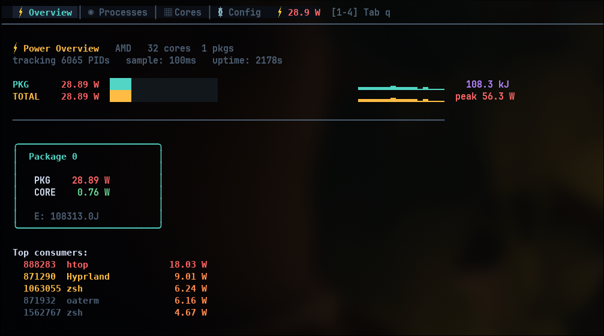

# watt



Per-process power monitoring TUI for Linux. Reads RAPL MSRs via a kernel module and shows real-time wattage per process, core, and package.

Supports Intel (Sandy Bridge+) and AMD (Zen+).

## Build

```bash
sudo apt install linux-headers-$(uname -r) libncurses-dev   # prerequisites
make            # builds everything (kernel module + watt + tools)
```

## Run

```bash
sudo insmod kernel/powmon.ko track_all=1
sudo ./watt
```

## Project structure

```
watt/
├── src/watt.c              # main TUI app
├── kernel/                 # powmon kernel module
│   ├── src/powmon.c
│   └── include/powmon.h    # shared UAPI header
├── tools/                  # CLI utilities
│   ├── powmon-cli.c
│   └── powmon-top.c
└── lib/flux.h/             # TUI framework (git submodule)
```

## Dependencies

- [flux.h](https://github.com/olealgoritme/flux.h) — single-header Elm Architecture TUI framework (pulled automatically as a git submodule)

## License

GPL-2.0
